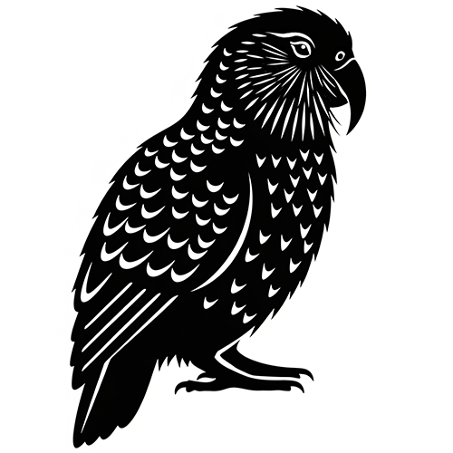

# Kakapo Distortion

The *Kakapo Distortion* is a PCB based on the Kokko Distortion, which seems to be a combination of a TubeScreamer and a RAT. This pedal was a collaboration with Cybercow (moo) on the PedalPCB forums. Cybercow traced the circuit and made a few modifications, which I've validated. The result is a fairly intense distortion sound. One peculiarity of this pedal is that unlike a lot of the other boutique circuits I've laid out, Kokko pedals are mostly bargain-basement clones. It still sounds great, though!

The name from this pedal is based on the [Kakapo](https://en.wikipedia.org/wiki/K%C4%81k%C4%81p%C5%8D), an extremely smart parrot that lives in New Zealand. This bird was selected for the pedal based on the similarity of the name with the Kokko brand.

If you'd like to just get started, you can go ahead and download the [gerber](https://github.com/RWLPedal/music-pcbs/raw/refs/heads/main/KakapoDistortion/KakapoDistortion.zip) for fabrication.

## Bill of materials

| References | Value  | Type                   | Notes               |
| :--------- | :----- | :--------------------- | :------------------ |
| C1         | 22N    | Film Capacitor         |                     |
| C2         | 100N   | Film Capacitor         |                     |
| C3         | 33N    | Film Capacitor         |                     |
| C4         | 820P   | MLCC Capacitor         |                     |
| C5         | 2U2    | Electrolytic Capacitor |                     |
| C6         | 6N8    | Film Capacitor         |                     |
| C7         | 820P   | MLCC Capacitor         |                     |
| C8         | 1U     | Film Capacitor         | Can be electrolytic |
| C9         | 100N   | Electrolytic Capacitor |                     |
| C10        | 100N   | 1/4W Resistor          |                     |
| C11        | 10U    | Electrolytic Capacitor |                     |
| C12        | 100U   | Electrolytic Capacitor |                     |
| C13        | 47U    | Electrolytic Capacitor |                     |
| C14        | 100N   | Film Capacitor         |                     |
| D1         | 1N5817 | Schottky Diode         |                     |
| D2         | LED    | LED                    |                     |
| D3         | LED    | LED                    |                     |
| D4         | 1N914  | Diode                  |                     |
| D5         | 1N914  | Diode                  |                     |
| D100       | LED    | LED                    | Bypass indicator    |
| Q1         | 2N5088 | NPN Transistor         | Or 2N3904           |
| Q2         | 2N5088 | NPN Transistor         | Or 2N3904           |  |
| R1         | 10K    | 1/4W Resistor          |                     |
| R2         | 470K   | 1/4W Resistor          |                     |
| R3         | 100K   | 1/4W Resistor          |                     |
| R4         | 1K5    | 1/4W Resistor          |                     |
| R5         | 10K    | 1/4W Resistor          |                     |
| R6         | 10K    | 1/4W Resistor          |                     |
| R7         | 10K    | 1/4W Resistor          |                     |
| R8         | 75R    | 1/4W Resistor          |                     |
| R9         | 12K    | 1/4W Resistor          |                     |
| R10        | 1K     | 1/4W Resistor          |                     |
| R11        | 10K    | 1/4W Resistor          |                     |
| R12        | 12K    | 1/4W Resistor          |                     |
| R13        | 47K    | 1/4W Resistor          |                     |
| R14        | 470K   | 1/4W Resistor          |                     |
| R15        | 10K    | 1/4W Resistor          |                     |
| R16        | 100R   | 1/4W Resistor          |                     |
| R17        | 10K    | 1/4W Resistor          |                     |
| R18        | 100R   | 1/4W Resistor          |                     |
| R19        | 56K    | 1/4W Resistor          |                     |
| R20        | 56K    | 1/4W Resistor          |                     |
| R21        | 33K    | 1/4W Resistor          |                     |
| R100       | 4K7    | 1/4W Resistor          | LEDR                |
| U1         | LM358  | Integrated Circuit     |                     |
| TONE       | B10K   | 16mm potentiometer     |                     |
| GAIN       | A100K  | 16mm potentiometer     |                     |
| LEVEL      | B100K  | 16mm potentiometer     |                     |

If you want, an [interactive BOM](https://html-preview.github.io/?url=https://github.com/RWLPedal/music-pcbs/blob/main/KakapoDistortion/interactive_bom.html) is also available if you want the option of sorting components or highlighting them on the board.

### Changes from stock circuit

The stock Kokko Distortion circuit is slightly different from this layout. Cybercow made the following changes to the circuit:

* The IC was changed from RC4558 to an LM358. Without this change, there was substantial squealing with the gain knob turned up. The LM358 has a lower slew-rate than the RC4558.
* Also to help reduce squeal, capacitors C4 and C7 were changed from 22P and 620P to 820P.
* The transistors were changed from 2N3904 to 2N5088. While the 2N3904 sound good as well, higher-gain 2N5088s give it a more fun, wilder growl.
* A 33K resistor (R21) was added between the volume pot and ground. Without this, when the volume knob is low, there is no sound at all.
* Two 1N914 diodes were added to reduce background noise (D4/D5).

### Not listed

As with most guitar pedal BOMs, the following components are not listed above:

* Footswitch
* DC Jack
* 2x 1/4" audio jack
* Enclosure: this pedal fits into a 125B enclosure.
* Sockets (for the transistors and IC).
* Wire
* Solder

## Layout

This pedal uses a standard [three-knob layout](https://github.com/RWLPedal/music-pcbs/blob/main/instructions/DRILLING.md).

### Screenshots

Here are the front and back with traces and component values:

Here is the front of the PCB with references rather than values:

### Offboard wiring

Offboard wiring is standard for this pedal. See the [detailed offboard wiring instructions](https://github.com/RWLPedal/music-pcbs/blob/main/instructions/WIRING.md) if you want more specifics.

## Schematic

Below is the KiCad schematic.

## Licensing

This layout is licensed with a Creative Commons BY-NC-SA 4.0 license (Attribution, Non-commercial, Share-alike).

## Versions

* V1.0 - Added three components (33k resistor to ground, two diodes) and updated labels.
* V0.9 - First version, this did not incorporate Cybercows updates (see above), but worked with the caveats noted and some components substituted.