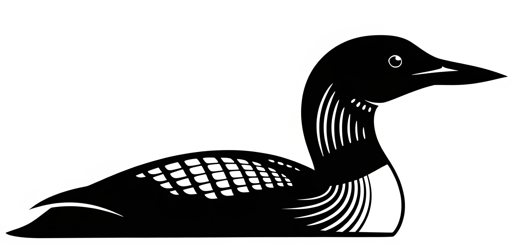

# Pacific Loon Tremolo

The *Pacific Loon Tremolo* is a PCB based on [Dylan159's Trembling Satellite](https://bentfishbowl.wixsite.com/electronics/post/trembling-satellite-tremolo), a version of the Tremulus Lune DIY tremolo. Dylan159 reworked the Tremulous Circuit to improve the gain stage and reduce background noise. The result is a very nice tremolo.

The bird to select for this layout is obvious enough, a loon. I went with the [Pacific Loon specifically](https://ebird.org/species/pacloo). I figured it was a good fit based on the calm nature of the background noise on the pedal.

Loons are slick-looking waterbirds with disinctive heads and necks, but they're probably most known for their call - one of the most iconic calls on TV and movies, especially at night. You might [recognize it](https://www.youtube.com/watch?v=DVFBUIGfcJk) even if you aren't a birdwatcher.

If you'd like to just get started, you can go ahead and download the [gerber](https://github.com/RWLPedal/music-pcbs/raw/refs/heads/main/PacificLoonTremolo/PacificLoonTremolo.zip) for fabrication.

## Bill of materials

You can find an [interactive BOM](https://html-preview.github.io/?url=https://github.com/RWLPedal/music-pcbs/blob/main/PacificLoonTremolo/interactive_bom.html), which contains all reference numbers, component counts, and more. But it should not be neccessary for populating the pedal.

As with all Dylan159 designs, the components for this pedal are all easily sourced.

### Not listed

As with most guitar pedal BOMs, the following components are not listed above:

* Footswitch
* DC Jack
* 2x 1/4" audio jack
* Enclosure: this pedal fits into a 125B enclosure.
* Sockets (for the transistor, LDR/LED, or ICs).
* Wire
* Solder

## Layout

This pedal uses the standard [three knob with the switch on the left](https://github.com/RWLPedal/music-pcbs/blob/main/instructions/DRILLING.md) layout. However, rather than a switch there's an optional LED you can use to view the tremolo rate.

### Screenshots

Here are the front and back with traces and component values:

Here is the front of the PCB with references rather than values:

### Offboard wiring

Offboard wiring is standard for this pedal. See the [detailed offboard wiring instructions](https://github.com/RWLPedal/music-pcbs/blob/main/instructions/WIRING.md) if you want more specifics.

## Schematic

Below is the KiCad schematic.

## Licensing

This layout is licensed with a Creative Commons BY-NC-SA 4.0 license (Attribution, Non-commercial, Share-alike).

## Versions

* V1.1 - Updated silkscreen, added more icons, and tweaked a few traces.
* V1.0 - First version, validated and works well.