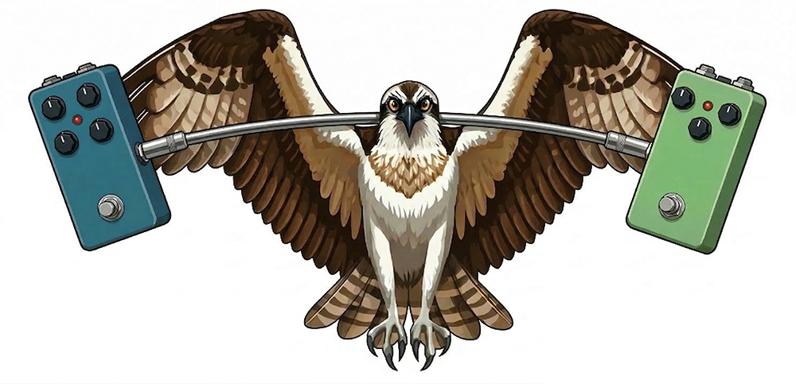

# RWL Pedal PCBs

This is a repository for sharing PCB layouts, and pedal-building advice. Most PCBs here are for effects pedals.

PCBs shared here follow consistent [conventions](instructions/CONVENTIONS.md) and [control layouts](instructions/DRILLING.md) to the extent possible. If you've never had PCBs fabricated before, check out the [fabrication instructions](instructions/FABRICATION.md) - it's easy and cheap to have PCBs manufactured.

## PCBs

### DIY-related PCBs

The following PCBs are DIY-related, meaning they are based on kits or from circuits shared on pedal-building forums. However, many are based on classic pedals (or are the basis for them).

|                          PCB Name                           |       Type       |        Circuit Name         | Circuit Author  | Fav?  |
| :---------------------------------------------------------: | :--------------: | :-------------------------: | :-------------: | :---: |
|    [Buffalo-Weaver Overdrive](/BuffaloWeaverOverdrive/)     |    Overdrive     | Guitar Magazine Tube Bender |   Dan Coggins   |
|             [Corn Crake Fuzz](/CornCrakeFuzz/)              |       Fuzz       |          NG-4 Fuzz          |    Dylan159     |
|           [Dipper Compressor](/DipperCompressor/)           |    Compressor    |      "That" Compressor      |    Dylan159     |
|            [Fledgling Phaser](/FledglingPhaser/)            |      Phaser      |     PUP: Litter of Four     |    Dylan159     |
|    [Footswitch Daughterboard](/FootswitchDaughterboard/)    |     Utility      |             N/A             |       N/A       |
|          [Gray Hornbill Fuzz](/GrayHornbillFuzz/)           |    Sitar/Fuzz    |           Jawari            |  Tim Escobedo   |
|    [Li'l Black Cormorant Fuzz](/LilBlackCormorantFuzz/)     |       Fuzz       |       L'il Black Key        |      BYOC       |
|           [Li'l Echo Parakeet](/LilEchoParakeet/)           |      Delay       |          L'il Echo          |      BYOC       |
|        [Pacific Loon Tremolo](/PacificLoonTremolo/)         |     Tremolo      |     Trembling Satellite     |    Dylan159     |
| [Screech Owl Harmonic Tremolo](/ScreechOwlHarmonicTremolo/) | Harmonic Tremolo |         Equanimity          |  Cees van Eijk  |   *   |
|          [Sharp-shinned Fuzz](/SharpShinnedFuzz/)           |       Fuzz       |     One-Knobber Project     | Effects Layouts |
|               [Shiny Cowbird](/ShinyCowbird/)               |       Fuzz       |   Dyl-Ei Fuzz Apprentice    |    Dylan159     |
|     [Shred-Masked Distortion](/ShredMaskedDistortion/)      |    Distortion    |          Shredder           |      BYOC       |
|             [Songifier Boost](/SongifierBoost/)             |  Boost & Buffer  |          Sonofier           |  Cees van Eijk  |
|               [Tui Overdrive](/TuiOverdrive/)               |    Overdrive     |        Supreaux Deux        |  RunOffGroove   |   *   |
|               [Tiny Tyrant](/TinyTyrantPll/)                |       PLL        |           PLLedal           |    Dylan159     |
|                [Weaver Boost](/WeaverBoost/)                |   Dirty Boost    |          Artiflex           |  Cees van Eijk  |
|    [White-Throated Overdrive](/WhiteThroatedOverdrive/)     |    Overdrive     |  Dudson Narrowest Castest   |    Dylan159     |   *   |

### Commercial

The following PCBs are based on commercial circuits:

|                          PCB Name                          |       Type       |                Compare to                | Fav?  |
| :--------------------------------------------------------: | :--------------: | :--------------------------------------: | :---: |
|           [CrimsonKiwi](/CrimsonKiwiOverdrive/)            | Octave Overdrive |         Way Huge Purple Platypus         |   *   |
|     [Honeycreeper Overdrive](/HoneycreeperOverdrive/)      |    Overdrive     |        Mad Professor Sweet Honey         |   *   |
|                 [Horus Fuzz](/HorusFuzz/)                  |       Fuzz       |       Black Art Toneworks Pharoah        |   *   |
|          [Kakapo Distortion](/KakapoDistortion/)           |    Distortion    |             Kokko Distortion             |       |
|             [King Eider Fuzz](/KingEiderFuzz/)             |       Fuzz       | Catalinbread Katzenkönig/AionFX Poseidon |   *   |
| [Northern Harrier Distortion](/NorthernHarrierDistortion/) |    Distortion    |                ProCo RAT                 |
|        [Morepork Distortion](/MoreporkDistortion/)         |    Distortion    |             MXR Distortion+              |
|               [Potoo Octave](/PotooOctave/)                |   Octave Fuzz    |      Fuzzhugger(fx) Phantom Octave       |
|        [Red-winged Overdrive](/RedwingedOverdrive/)        |    Overdrive     |              EHX Hot Tubes               |   *   |
|   [Saturnine Antshrike Boost](/SaturnineAntshrikeBoost/)   |      Boost       |            Spaceman Saturn V             |   *   |
|             [Shoebill Boost](/ShoebillBoost/)              |      Boost       |           Way Huge Angry Troll           |
|           [WhippoorwillFuzz](/WhippoorwillFuzz/)           |       Fuzz       |    Dunwich Amplification Cthulhu Fuzz    |

## Guides

The following are guides for my layouts, or for pedal-building in general:

* [Conventions](instructions/CONVENTIONS.md) - Layout and placement conventions I attempt to follow.
* [Drilling](instructions/DRILLING.md) - Drill templates for RWL pedals.
* [Fabrication](instructions/FABRICATION.md) - How exactly do you turn Gerber files into physical PCBs? Learn more here.
* [KiCAD Files](KiCAD/KICAD_SETUP.md) - Files I use in KiCAD for my layouts (footprints and symbols) and how to install them.
* [Wiring](instructions/WIRING.md) - Shows how to wire all pedals I've shared.