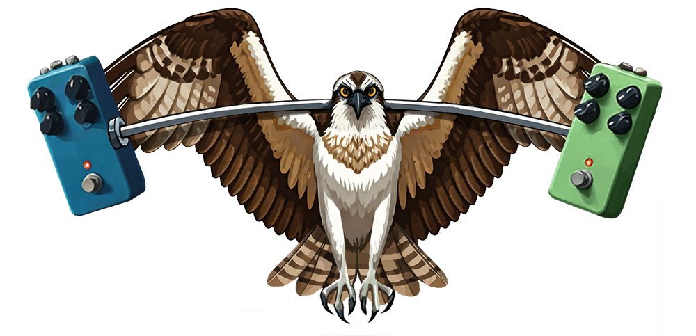

# RWL Pedal PCBs

This is a repository for sharing PCB layouts, and pedal-building advice. Most PCBs are for effects pedals.

PCBs shared here follow consistent [conventions](instructions/CONVENTIONS.md) and [control layouts](instructions/DRILLING.md) to the extent possible. If you've never had PCBs fabricated and always bought them pre-populated, check out the [fabrication instructions](instructions/FABRICATION.md) - it's easy and cheap to have PCBs fabricated.

## PCBs

### DIY-related PCBs
The following PCBs are DIY-related, meaning they are based on kits or from circuits shared on pedal-building forums.

|                          PCB Name                           | PCB Author |       Type       |        Circuit Name         | Circuit Author  |
| :---------------------------------------------------------: | :--------: | :--------------: | :-------------------------: | :-------------: |
|    [Buffalo-Weaver Overdrive](/BuffaloWeaverOverdrive/)     |    RWL     |    Overdrive     | Guitar Magazine Tube Bender |   Dan Coggins   |
|           [Dipper Compressor](/DipperCompressor/)           |    RWL     |    Compressor    |      "That" Compressor      |    Dylan159     |
|            [Fledgling Phaser](/FledglingPhaser/)            |    RWL     |      Phaser      |     PUP: Litter of Four     |    Dylan159     |
|    [Footswitch Daughterboard](/FootswitchDaughterboard/)    |    RWL     |     Utility      |             N/A             |       N/A       |
|          [Gray Hornbill Fuzz](/GrayHornbillFuzz/)           |    RWL     |    Sitar/Fuzz    |           Jawari            |  Tim Escobedo   |
|    [Li'l Black Cormorant Fuzz](/LilBlackCormorantFuzz/)     |    RWL     |       Fuzz       |       L'il Black Key        |      BYOC       |
| [Screech Owl Harmonic Tremolo](/ScreechOwlHarmonicTremolo/) |    RWL     | Harmonic Tremolo |         Equanimity          |  Cees van Eijk  |
|          [Sharp-shinned Fuzz](/SharpShinnedFuzz/)           |    RWL     |       Fuzz       |     One-Knobber Project     | Effects Layouts |
|               [Shiny Cowbird](/ShinyCowbird/)               |    RWL     |       Fuzz       |   Dyl-Ei Fuzz Apprentice    |    Dylan159     |
|               [Tiny Tyrant](/TinyTyrantPll/)                |    RWL     |       PLL        |           PLLedal           |    Dylan159     |
|    [White-Throated Overdrive](/WhiteThroatedOverdrive/)     |    RWL     |    Overdrive     |  Dudson Narrowest Castest   |    Dylan159     |

### Commercial

The following PCBs are based on commercial circuits:

|                          PCB Name                          | PCB Author |       Type       |                 Based on                 |
| :--------------------------------------------------------: | :--------: | :--------------: | :--------------------------------------: |
|           [CrimsonKiwi](/CrimsonKiwiOverdrive/)            |    RWL     | Octave Overdrive |         Way Huge Purple Platypus         |
|     [Honeycreeper Overdrive](/HoneycreeperOverdrive/)      |    RWL     |    Overdrive     |        Mad Professor Sweet Honey         |
|             [King Eider Fuzz](/KingEiderFuzz/)             |    RWL     |       Fuzz       | Catalinbread Katzenkönig/AionFX Poseidon |
| [Northern Harrier Distortion](/NorthernHarrierDistortion/) |    RWL     |    Distortion    |                ProCo RAT                 |
|        [Morepork Distortion](/MoreporkDistortion/)         |    RWL     |    Distortion    |             MXR Distortion+              |
|               [Potoo Octave](/PotooOctave/)                |    RWL     |   Octave Fuzz    |      Fuzzhugger(fx) Phantom Octave       |
|        [Red-winged Overdrive](/RedwingedOverdrive/)        |    RWL     |    Overdrive     |              EHX Hot Tubes               |

## Guides

The following are guides for my layouts, or for pedal-building in general:

* [Conventions](instructions/CONVENTIONS.md) - Layout and placement conventions I attempt to follow.
* [Drilling](instructions/DRILLING.md) - Drill templates for RWL pedals.
* [Fabrication](instructions/FABRICATION.md) - How exactly do you turn Gerber files into physical PCBs? Learn more here.
* [KiCAD Files](KiCAD/KICAD_SETUP.md) - Files I use in KiCAD for my layouts (footprints and symbols) and how to install them.
* [Wiring](instructions/WIRING.md) - Shows how to wire all pedals I've shared.