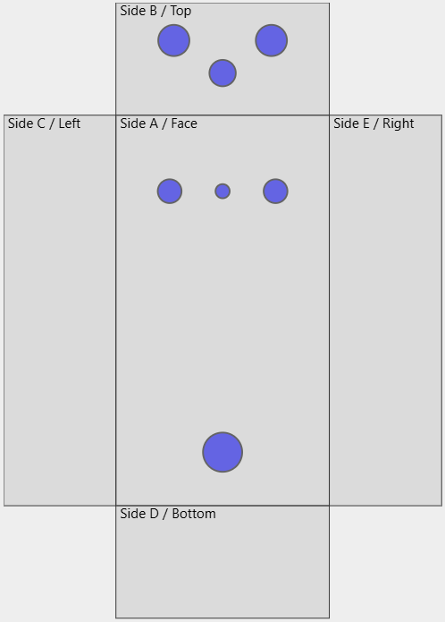
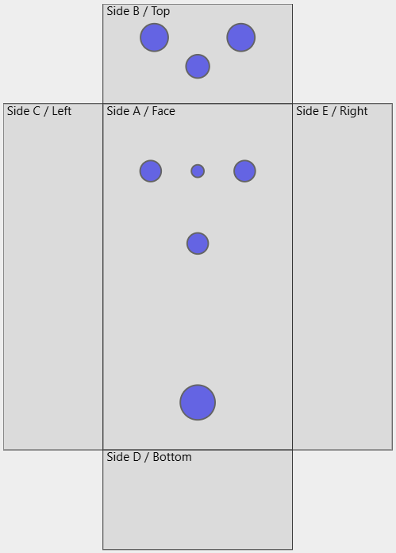
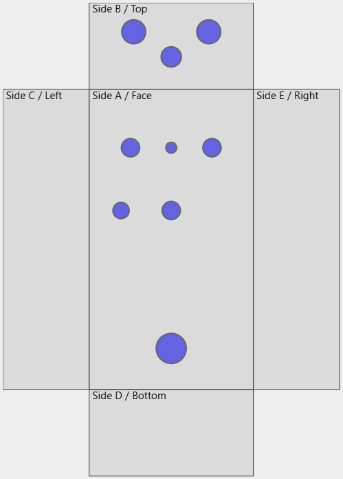
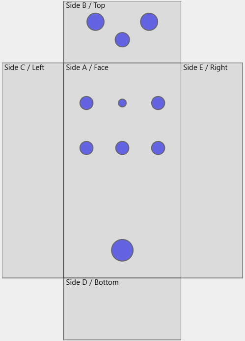

# Drilling

This page shares drill templates for RWL PCBs.

These templates should apply for most pedals, but double-check on the pedal's page that the template is relevant. Note that most of these layouts are consistent with those of PedalPCB PCBs.

## Generic holes

### 125B
Unless otherwise noted, all 125B layouts expect holes in the following positions.

| Description    | Diameter | X Position | Y Position | Note     |
| :------------- | :------- | :--------- | :--------- | :------- |
| Audio In jack  | 9.7mm    | 15.2mm     | 5.75mm     | “B” face |
| Audio Out jack | 9.7mm    | \-15.2mm   | 5.75mm     | “B” face |
| Power jack     | 7.4mm    | 0mm        | 11.7mm     | “B” face |
| Footswitch     | 12.2mm   | 0mm        | \-44.1mm   | “A” face |

All RWL PCBs include an onboard LED, so that's not listed in the generic section.

## Specific Layouts

### 125B Two-Knob

This is the layout for a two-knob pedal in a 125B enclosure. This layout is similar to the three-knob layout... but with one fewer knob.

| Description | Diameter | X Position | Y Position | Note             |
| :---------- | :------- | :--------- | :--------- | :--------------- |
| Left Knob   | 7.4mm    | \-16.5mm   | 37.1mm     | Typically Volume |
| Right Knob  | 7.4mm    | 16.5mm     | 37.1mm     | Typically Gain   |
| LED         | 4.4mm    | 0mm        | 37.1mm     |                  |

Where possible, this layout will have the volume or level on the left, and other functions on the right.

Here's the [Tayda template](https://drill.taydakits.com/box-designs/new?public_key=cGxxdXdJMmdXUDFKTlhBMmhjQmU0UT09Cg==).

### 125B Three-Knob

This is the layout for a three-knob pedal in a 125B enclosure. It's a standard PedalPCB layout.

| Description | Diameter | X Position | Y Position | Note             |
| :---------- | :------- | :--------- | :--------- | :--------------- |
| Left Knob   | 7.4mm    | \-16.5mm   | 37.1mm     | Typically Volume |
| Right Knob  | 7.4mm    | 16.5mm     | 37.1mm     | Typically Gain   |
| Bottom Knob | 7.4mm    | 0mm        | 11.7mm     | Typically Tone   |
| LED         | 4.4mm    | 0mm        | 37.1mm     |                  |

Most three-knob pedals are overdrive/fuzz/distortion, where the knobs will have consistent functions.

Here's the [Tayda template](https://drill.taydakits.com/box-designs/new?public_key=TFREWG9zYWl5NUE0OTBrQmdlZGErZz09Cg==).

### 125B Three-Knob with Switch

This is the layout for a three-knob pedal in a 125B enclosure, which also includes a switch.

| Description | Diameter | X Position | Y Position | Note             |
| :---------- | :------- | :--------- | :--------- | :--------------- |
| Left Knob   | 7.4mm    | \-16.5mm   | 37.1mm     | Typically Volume |
| Right Knob  | 7.4mm    | 16.5mm     | 37.1mm     | Typically Gain   |
| Bottom Knob | 7.4mm    | 0mm        | 11.7mm     | Typically Tone   |
| Switch      | 6.6mm    | \-20.32mm  | 11.7mm     |                  |
| LED         | 4.4mm    | 0mm        | 37.1mm     |                  |

Here's the [Tayda template](https://drill.taydakits.com/box-designs/new?public_key=bFU1ZURpZ2Y5T0VNM2VHdXU5UTZ2UT09Cg==).

This is also a standard PedalPCB layout (used for the[Chop Shop](https://www.pedalpcb.com/product/pcb051/), for example), but note that older PedalPCB boards with this layout have the switch vertically aligned with the leftmost knob, whereas this layout has it offset by 4mm. Some PedalPCB boards with three knobs and a switch have the switch centered, where the LED is located for this layout.

### 125B Five-Knob, LED Top

This is the layout for a five-knob pedal in a 125B enclosure, there the LED is centered in the grid of knobs in the middle top.

| Description | Diameter | X Position | Y Position |
| :---- | :---- | :---- | :---- |
| Top Left Knob | 7.4mm | \-20.32mm | 38.1mm |
| Top Right Knob | 7.4mm | 20.32mm | 38.1mm |
| Bottom Left Knob | 7.4mm | \-20.32mm | 12.7mm |
| Bottom Center Knob | 7.4mm | 0mm | 12.7mm |
| Bottom Right Knob | 7.4mm | 20.32mm | 12.7mm |
| LED | 4.4mm | 0mm | 38.1mm |

On PedalPCB, this layout is known as the "5-Knob Type 1" layout.

Here's the [Tayda template](https://drill.taydakits.com/box-designs/new?public_key=TXhROUIwcVl6SG1lS3o2cE1qbEFPUT09Cg==).