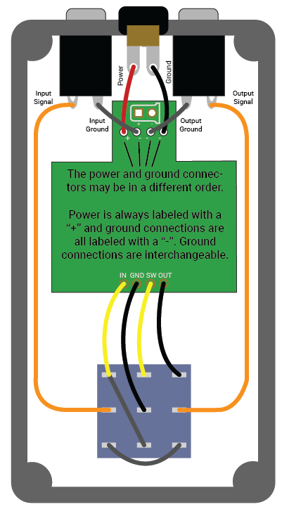

# Wiring

This page shares some basics for wiring of RWL boards.

## Basics of Wiring

Most guitar pedals require 4 connections from the board:

1. Power
2. Ground
3. Audio in
4. Audio out

Simply wiring these can be enough - for example, for basic testing or if you're wiring a few pedals within a single enclosure (using a PCB tester, such as PedalPCB's Auditorium). But just these four connectionsthey don't allow proper grounding or connecting to a footswitch. For that, you'll need another six wires.

## Wiring RWL layouts

I follow the typical PedalPCB conventions for wiring, as detailed in the diagram above. The diagram shows a pedal as viewed from behind, with the lid removed. The diagram has the following wires:

* **Power**: There is always a power socket at the top of the board, labeled with a "+".
* **Grounds**: There are always three grounds at the top of the board, labeled with a "-". These pads should connect to the two audio jacks, and to the DC jack. You can connect any of the pads to any of these jacks, they all go to the same place.
* **Audio in**: there is always an audio in, labeled "IN." Typically this would be connected to the footswitch.
* **Ground**: There is always a ground at the bottom of the board, labeled with "GND," to connect to the footswitch.
* **Switch**: There is always a switch pad at the bottom of the board, labeled with "SW," to connect to the footswitch.
* **Audio out**: there is always an audio in, labeled "OUT." Typically this would be connected to the footswitch.

You may connect the wires so they emerge from either the top side or underside of the PCB. Most people connect from the underside since it's easier to hide the wires and get a prettier build.

### Wiring LEDs

All RWL boards offer an onboard LED. You may omit this LED and the LEDR (usually highlighted on the bill of materials) if you would like, with no negative outcome on the circuit. If you do so, you can wire an offboard LED. If you omit it, you don't need to wire the **switch** pad.

### Using a daughterboard

It's a little easier to use a daughterboard than to connect all the pins of the footswitch to bits of wire. I offer a [Footswitch Daughterboard](../FootswitchDaughterboard/README.md) which you can have fabricated. All external connections to the footswitch will be labeled and you should be able to connect the wires straight across in order. Many companies offer daughterboards for footswitches that should work fine, although be careful to check the labels and order of the pads.